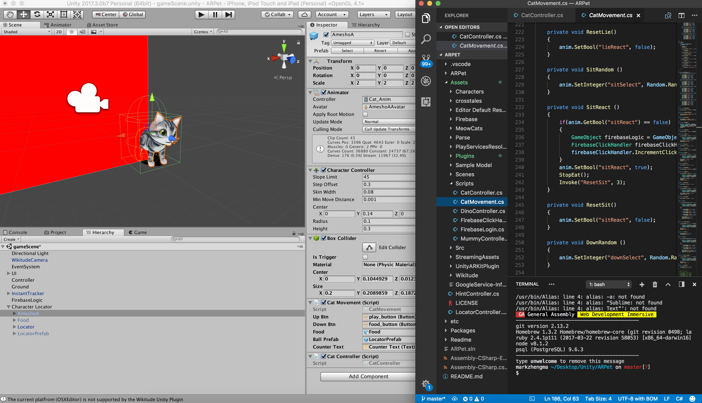

# To Be With You


## Description

An augmented reality pet game for mental health and education purposes.

## About the Design

The MVP is developed using Unity engine, Firebase, Wikitude augmented reality system and downloaded 3D assets. In our design, users are able to register and login to their own account, which is connected with the Firebase authentication database. After logged in, users would be able to interact with their virtual pet by “placing” them on the surfaces of the real world. This is achieved thanks to the package provided by Wikitude for educational and researching purposes. In the game, users are able to interact with the pet. There are different ways to interact with the pet, but different approaches would lead to different results based on the current status of the pet, for example, if the cat is happy and want to play with the user, feeding him/her might not be a good choice while playing with him/her would result in an increment of intimacy level. Intimacy level is a visible statistic that reflects how close the pet is with the user, higher level would result in boosting user’s level, which is a requirement to unlock different items from the store, and coins, which could be used to buy items, increment. This would help users customize their own pets and develop the close relationship with the pets. The users would also have a chance to interact with other players and their pets, by implementing online server, including chatting and real-time multiplayer, features, gamers community and screenshot sharing functionality. 

The pet’s reaction and approach selections would keep developing in the project, based on the researches on specific animal’s life patterns. Users would look for hints in order to interact with their pets in a better way and repeat this process many times during the gameplay. This makes the application have education potentials and let users feel connected with the pet by attempting, learning, applying and gaining the sense of achievement seeing the virtual character grows together with the pet.

## Developer

Mark Zheng Ma

## Fellow Contributers

* Ming Luo 
* Xiaoxue Chen 
* Min Huang 
* Huajian Gao

Marketing research, user feedback, project rational and scholar references.

## Technology

Wikitude
Unity
Firebase

## Screenshots

From the MVP.




## Code Snippet

CatController.cs

```
using UnityEngine;
using UnityEngine.UI;
using System.Collections;
using UnityEngine.EventSystems;

public class CatMovement : MonoBehaviour 
{

	private Animator anim;

	public Button upBtn;
	public Button downBtn;
	public GameObject food;
	public GameObject ballPrefab;

	public Text counterText;

	float tempTime;

	void Awake()
	{
		anim = GetComponentInChildren<Animator>();
		// anim.SetBool("stand", true);
	}

	void OnMouseDown ()
	{
		if(anim.GetBool("stand") == true)
		{
			StandReact ();
		}
		if(anim.GetBool("lie") == true)
		{
			LieReact ();
		}
		if(anim.GetBool("sit") == true)
		{
			SitReact ();
		}
		if(anim.GetBool("down") == true)
		{
			DownReact ();
		}
		if(anim.GetBool("back") == true)
		{
			BackReact ();
		}
	}

	void Start ()
	{
		// Button buttonOne = upBtn.GetComponent<Button> ();
		// buttonOne.onClick.AddListener(Stand);
		// Button buttonTwo = playBtn.GetComponent<Button> ();
		// buttonTwo.onClick.AddListener(Sit);
		// Button buttonThree = downBtn.GetComponent<Button> ();
		// buttonThree.onClick.AddListener(Curl);
		if(int.Parse(counterText.text) < 10)
			{
				anim.SetBool("stand", false);
				anim.SetBool("lie", true);
				anim.SetBool("sit", false);
				anim.SetBool("down", false);
				anim.SetBool("back", false);
			}
			if(int.Parse(counterText.text) >= 10 && int.Parse(counterText.text) < 20)
			{
				anim.SetBool("stand", true);
				anim.SetBool("lie", false);
				anim.SetBool("sit", false);
				anim.SetBool("down", false);
				anim.SetBool("back", false);
			}
			if(int.Parse(counterText.text) >= 20 && int.Parse(counterText.text) < 30)
			{
				anim.SetBool("stand", false);
				anim.SetBool("lie", false);
				anim.SetBool("sit", true);
				anim.SetBool("down", false);
				anim.SetBool("back", false);
			}
			if(int.Parse(counterText.text) >= 30 && int.Parse(counterText.text) < 40)
			{
				anim.SetBool("stand", false);
				anim.SetBool("lie", false);
				anim.SetBool("sit", false);
				anim.SetBool("down", true);
				anim.SetBool("back", false);
			}
			if(int.Parse(counterText.text) >= 40)
			{
				anim.SetBool("stand", false);
				anim.SetBool("lie", false);
				anim.SetBool("sit", false);
				anim.SetBool("down", false);
				anim.SetBool("back", true);
			}
	}

	void Update()
	{
		tempTime += Time.deltaTime;
        if (tempTime > 2.0) 
		{
        	tempTime = 0;
			SetStatus();

			if(anim.GetBool("stand") == true && anim.GetBool("standReact") == false)
			{
            	StandRandom ();
			}
			if(anim.GetBool("stand") == true && anim.GetBool("standReact") == true)
			{
				StandReactRandom ();
			}
			if(anim.GetBool("lie") == true && anim.GetBool("lieReact") == false)
			{
				LieRandom ();
			}
			if(anim.GetBool("sit") == true && anim.GetBool("sitReact") == false)
			{
				SitRandom ();
			}
			if(anim.GetBool("down") == true && anim.GetBool("downReact") == false)
			{
				DownRandom ();
			}
			if(anim.GetBool("back") == true && anim.GetBool("backReact") == false)
			{
				Debug.Log("Your cat wants to play with you!");
			}

         }
	}

	private void SetStatus (){
		if(int.Parse(counterText.text) < 10)
		{
			anim.SetBool("stand", false);
			anim.SetBool("lie", true);
			anim.SetBool("sit", false);
			anim.SetBool("down", false);
			anim.SetBool("back", false);
		}
		if(int.Parse(counterText.text) >= 10 && int.Parse(counterText.text) < 20)
		{
			anim.SetBool("stand", true);
			anim.SetBool("lie", false);
			anim.SetBool("sit", false);
			anim.SetBool("down", false);
			anim.SetBool("back", false);
		}
		if(int.Parse(counterText.text) >= 20 && int.Parse(counterText.text) < 30)
		{
			anim.SetBool("stand", false);
			anim.SetBool("lie", false);
			anim.SetBool("sit", true);
			anim.SetBool("down", false);
			anim.SetBool("back", false);
		}
		if(int.Parse(counterText.text) >= 30 && int.Parse(counterText.text) < 40)
		{
			anim.SetBool("stand", false);
			anim.SetBool("lie", false);
			anim.SetBool("sit", false);
			anim.SetBool("down", true);
			anim.SetBool("back", false);
		}
		if(int.Parse(counterText.text) >= 40)
		{
			anim.SetBool("stand", false);
			anim.SetBool("lie", false);
			anim.SetBool("sit", false);
			anim.SetBool("down", false);
			anim.SetBool("back", true);
		}
	}

	private void StandRandom ()
	{
		anim.SetInteger("standSelect", Random.Range(0, 3));
	}

	private void StandReactRandom ()
	{
		anim.SetInteger("standReactSelect", Random.Range(1, 4));
		Invoke("ResetStand", 4);
	}

	private void ResetStand()
	{
		anim.SetBool("standReact", false);
		anim.SetInteger("standReactSelect", 0);
	}

	private void StandReact ()
	{
		GameObject firebaseLogic = GameObject.Find("FirebaseLogic");
		FirebaseClickHandler firebaseClickHandler = firebaseLogic.GetComponent<FirebaseClickHandler>();
		firebaseClickHandler.IncrementClickCounter();
		anim.SetBool("standReact", true);
		StopEat();
	}

	private void LieRandom ()
	{
		anim.SetInteger("lieSelect", Random.Range(0, 2));
	}

	private void LieReact ()
	{
		if(anim.GetBool("lieReact") == false)
		{
			GameObject firebaseLogic = GameObject.Find("FirebaseLogic");
			FirebaseClickHandler firebaseClickHandler = firebaseLogic.GetComponent<FirebaseClickHandler>();
			firebaseClickHandler.IncrementClickCounter();
		}
		anim.SetBool("lieReact", true);
		Invoke("ResetLie", 3);
	}

	private void ResetLie()
	{
		anim.SetBool("lieReact", false);
	}

	private void SitRandom ()
	{
		anim.SetInteger("sitSelect", Random.Range(0, 3));
	}

	private void SitReact ()
	{
		if(anim.GetBool("sitReact") == false)
		{
			GameObject firebaseLogic = GameObject.Find("FirebaseLogic");
			FirebaseClickHandler firebaseClickHandler = firebaseLogic.GetComponent<FirebaseClickHandler>();
			firebaseClickHandler.IncrementClickCounter();
		}
		anim.SetBool("sitReact", true);
		StopEat();
		Invoke("ResetSit", 3);
	}

	private void ResetSit()
	{
		anim.SetBool("sitReact", false);
	}

	private void DownRandom ()
	{
		anim.SetInteger("downSelect", Random.Range(0, 2));
	}

	private void DownReact ()
	{
		if(anim.GetBool("downReact") == false)
		{
			GameObject firebaseLogic = GameObject.Find("FirebaseLogic");
			FirebaseClickHandler firebaseClickHandler = firebaseLogic.GetComponent<FirebaseClickHandler>();
			firebaseClickHandler.IncrementClickCounter();
		}
		anim.SetBool("downReact", true);
		StopEat();
		Invoke("ResetDown", 3);
	}

	private void ResetDown()
	{
		anim.SetBool("downReact", false);
	}

	private void BackReact ()
	{
		if(anim.GetBool("backReact") == false)
		{
			GameObject firebaseLogic = GameObject.Find("FirebaseLogic");
			FirebaseClickHandler firebaseClickHandler = firebaseLogic.GetComponent<FirebaseClickHandler>();
			firebaseClickHandler.IncrementClickCounter();
		}
		anim.SetBool("backReact", true);
		Invoke("ResetBack", 3);
	}

	private void ResetBack()
	{
		anim.SetBool("backReact", false);
	}

	public void Eat()
	{
		if(int.Parse(counterText.text) < 10 || int.Parse(counterText.text) > 40)
		{
			GameObject firebaseLogic = GameObject.Find("FirebaseLogic");
			FirebaseClickHandler firebaseClickHandler = firebaseLogic.GetComponent<FirebaseClickHandler>();
			firebaseClickHandler.DecreaseCounter();
		}
		else
		{
			if(anim.GetBool("sit") == true){
				anim.SetBool("sit", false);
			}
			if(anim.GetBool("down") == true){
				anim.SetBool("down", false);
			}
			if(anim.GetBool("stand") == true){
				anim.SetBool("stand", false);
			}
			anim.SetBool("eat", true);
			food.SetActive(true);
			Invoke("EatIncrement", 4);
		}
	}

	private void EatIncrement()
	{
		if(anim.GetBool("eat") == true && anim.GetBool("lie") == false && anim.GetBool("back") == false)
		{
			GameObject firebaseLogic = GameObject.Find("FirebaseLogic");
			FirebaseClickHandler firebaseClickHandler = firebaseLogic.GetComponent<FirebaseClickHandler>();
			firebaseClickHandler.MoreIncrementClickCounter();
		}
		SetStatus();
		Invoke("StopEat", 1);
	}

	private void StopEat()
	{
		anim.SetBool("eat", false);
		food.SetActive(false);
	}

	public void Ball()
	{
		if(int.Parse(counterText.text) < 20 || int.Parse(counterText.text) > 40)
		{
			GameObject firebaseLogic = GameObject.Find("FirebaseLogic");
			FirebaseClickHandler firebaseClickHandler = firebaseLogic.GetComponent<FirebaseClickHandler>();
			firebaseClickHandler.DecreaseCounter();
		}
		else
		{
			if(anim.GetBool("sit") == true){
				anim.SetBool("sit", false);
			}
			if(anim.GetBool("down") == true){
				anim.SetBool("down", false);
			}
			anim.SetBool("ball", true);
			GameObject obj = Instantiate(ballPrefab, new Vector3(0, 1, 0), Quaternion.identity) as GameObject;
			Invoke("BallIncrement", 4);
		}
	}

	private void BallIncrement()
	{
		if(anim.GetBool("ball") == true && anim.GetBool("lie") == false && anim.GetBool("stand") == false && anim.GetBool("back") == false)
		{
			GameObject firebaseLogic = GameObject.Find("FirebaseLogic");
			FirebaseClickHandler firebaseClickHandler = firebaseLogic.GetComponent<FirebaseClickHandler>();
			firebaseClickHandler.MoreIncrementClickCounter();
		}
		SetStatus();
		Invoke("StopBall", 1);
	}

	private void StopBall()
	{
		anim.SetBool("ball", false);
		// food.SetActive(false);
	}
}
```